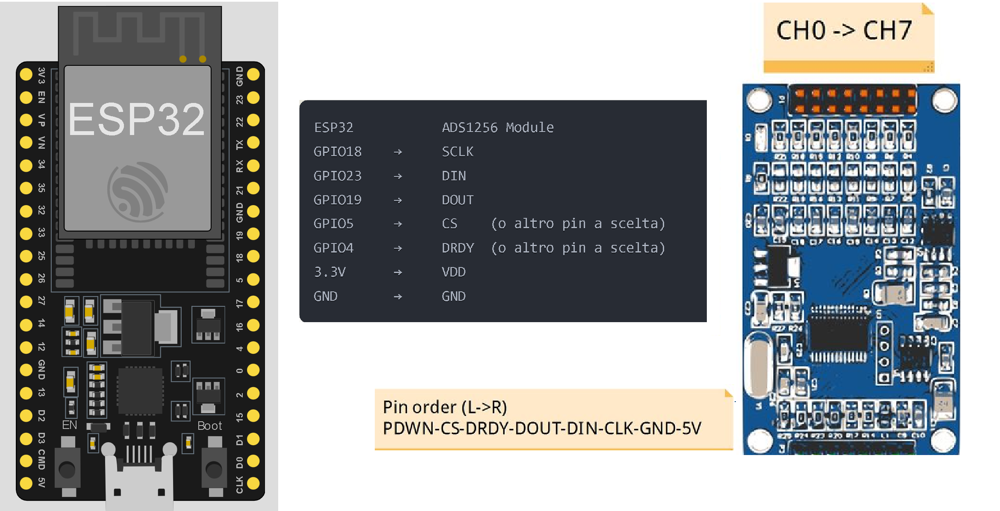
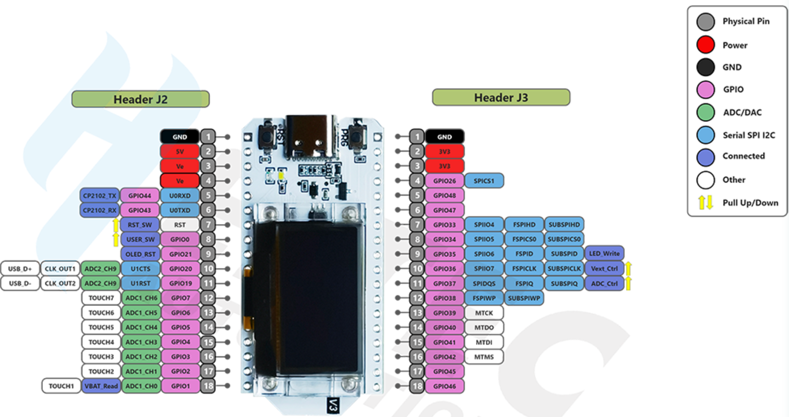

>[Torna all'indice](readme.md#fasi-progetto)


# Guida Collegamento ADS1256 con ESP32

## Hardware

### Modulo ADS1256
Il modulo utilizzato è un ADC (Analog to Digital Converter) ADS1256 con le seguenti caratteristiche:
- 24-bit di risoluzione
- 8 canali analogici
- Fino a 30kSPS di sampling rate
- Level shifter 5V-3.3V integrato
- Range di input analogico: ±5V (con alimentazione 5V)

### Collegamenti

#### Pin ESP32 → Modulo ADS1256
| ESP32 Pin | ADS1256 Pin | Descrizione |
|-----------|-------------|-------------|
| GPIO18    | SCLK        | Clock SPI |
| GPIO23    | DIN         | Data In (MOSI) |
| GPIO19    | DOUT        | Data Out (MISO) |
| GPIO5*    | CS          | Chip Select |
| GPIO4*    | DRDY        | Data Ready |
| 3.3V      | VDD         | Alimentazione |
| GND       | GND         | Ground |

\* Questi pin possono essere cambiati con altri GPIO disponibili

#### Pin Opzionali
- RESET: Non necessario, ha pull-up interno
- PDWN: Non necessario, ha pull-up interno

### Note Importanti
1. **Alimentazione**
   - Il modulo può essere alimentato sia a 5V che a 3.3V
   - Con alimentazione a 5V si ha il massimo range di input analogico (±5V)
   - Con alimentazione a 3.3V il range di input si riduce proporzionalmente

2. **Level Shifting**
   - Il modulo include già la conversione di livello 5V-3.3V
   - Non sono necessari convertitori di livello aggiuntivi
   - I segnali digitali sono già compatibili con la logica 3.3V dell'ESP32

3. **Ground**
   - Per le migliori prestazioni, mantenere separati i ground analogici e digitali
   - Collegare entrambi in un unico punto vicino all'alimentazione

4. **Input Analogici**
   - AIN0-AIN7: Accettano tensioni nel range ±5V (con VDD=5V)
   - Impedenza di ingresso: >1MΩ
   - Protezione da sovratensioni integrata

## Configurazione Software

### Inizializzazione SPI
```cpp
// Definizione pin
#define ADS1256_DRDY_PIN 4
#define ADS1256_CS_PIN   5

// Configurazione SPI
SPIClass *spi = new SPIClass(VSPI);
spi->begin(18, 19, 23, 5); // SCLK, MISO, MOSI, SS

// Configurazione pin
pinMode(ADS1256_DRDY_PIN, INPUT);
pinMode(ADS1256_CS_PIN, OUTPUT);
digitalWrite(ADS1256_CS_PIN, HIGH);
```




### Scheda Hektec WiFi_Kit_32_v3




### PINOUT


| ADS1256 Pin | ESP32 Heltec V3 Pin | Funzione | Note |
|-------------|---------------------|-----------|-------|
| **Collegamenti SPI** ||||
| SCLK        | GPIO47 (SPICLK_P)  | Clock SPI | *Collegamenti digitali* |
| DIN         | GPIO35 (GPIO35)    | Data Input (MOSI) | *Collegamenti digitali* |
| DOUT        | GPIO36 (GPIO36)    | Data Output (MISO) | *Collegamenti digitali* |
| CS          | GPIO37 (GPIO37)    | Chip Select | *Collegamenti digitali* |
| DRDY        | GPIO38 (GPIO38)    | Data Ready | *Collegamenti digitali* |
| **Collegamenti DAC -> ADC** ||||
| AIN6        | GPIO1 (DAC1)       | Ingresso ADC+ canale diff. | *Collegamenti analogici* |
| AIN7        | GPIO2 (DAC2)       | Ingresso ADC- canale diff. | *Collegamenti analogici* |
| **Alimentazioni** ||||
| AVDD        | 3.3V (VDD_3V3)    | Alimentazione Analogica | *Separare dalle alimentazioni digitali* |
| DVDD        | 3.3V (VDD_3V3)    | Alimentazione Digitale | *Separare dalle alimentazioni analogiche* |
| PWDN        | 3.3V (VDD_3V3)    | Power Down (attivo basso) | *Collegamenti digitali* |
| **Masse** ||||
| AGND        | GND Analogico      | Ground Analogico | *Collegare al piano di massa analogico* |
| DGND        | GND Digitale       | Ground Digitale | *Collegare al piano di massa digitale* |


### Velocità SPI
- L'ADS1256 supporta clock SPI fino a 2MHz
- Consigliato iniziare con frequenze più basse (es. 1MHz) e aumentare se necessario
- La velocità può essere impostata con: `spi->beginTransaction(SPISettings(1000000, MSBFIRST, SPI_MODE1));`

## Troubleshooting
1. **Letture instabili**
   - Verificare la qualità dell'alimentazione
   - Controllare la connessione dei ground
   - Ridurre la velocità SPI

2. **Comunicazione non funzionante**
   - Verificare i collegamenti dei pin SPI
   - Controllare la tensione di alimentazione
   - Verificare che CS e DRDY funzionino correttamente

3. **Rumore nelle misure**
   - Utilizzare cavi schermati per gli input analogici
   - Separare i percorsi dei segnali analogici e digitali
   - Considerare l'uso di ferriti sui cavi di alimentazione

Il FW, completo di pagina web di interfaccia, è reperibile nella cartella src: https://github.com/marconicivitavecchia/2024-pedana-salto/tree/main/src

La libreria ```ADS1256_DMA.h``` in uso imposta già internamente sia le porte digitali che il BUS SPI secondo le pedinature sopra riportate per cui non è necessario eseguire la loro configurazione esplicita all'interno della funzione ```setup()```.

Sitografia:
- https://espressif-docs.readthedocs-hosted.com/projects/arduino-esp32/en/latest/api/timer.html
- https://claude.ai/chat/577f5692-3126-4db2-abea-41f3730c12e6

>[Torna all'indice](readme.md#fasi-progetto)

