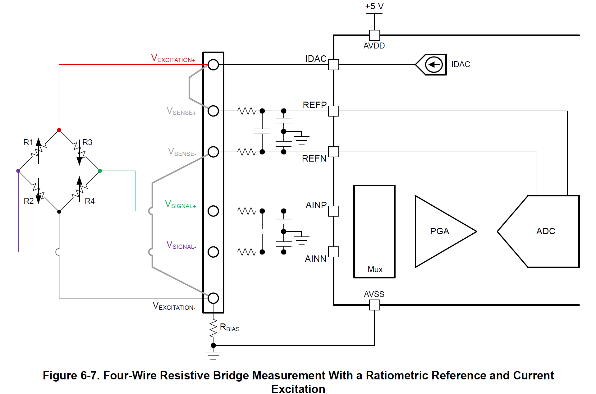
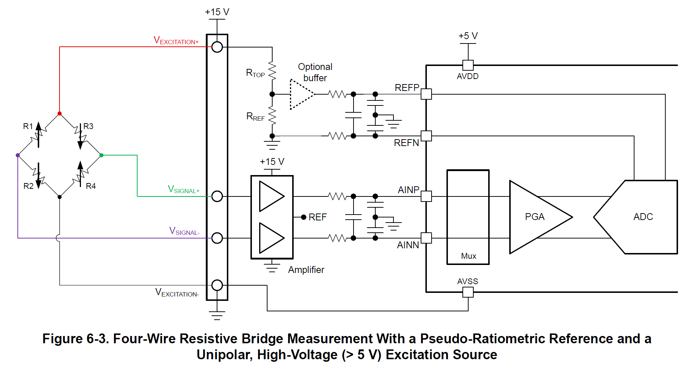
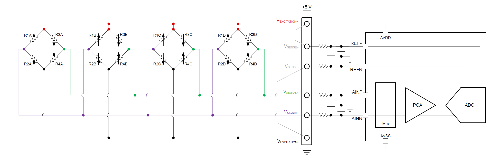
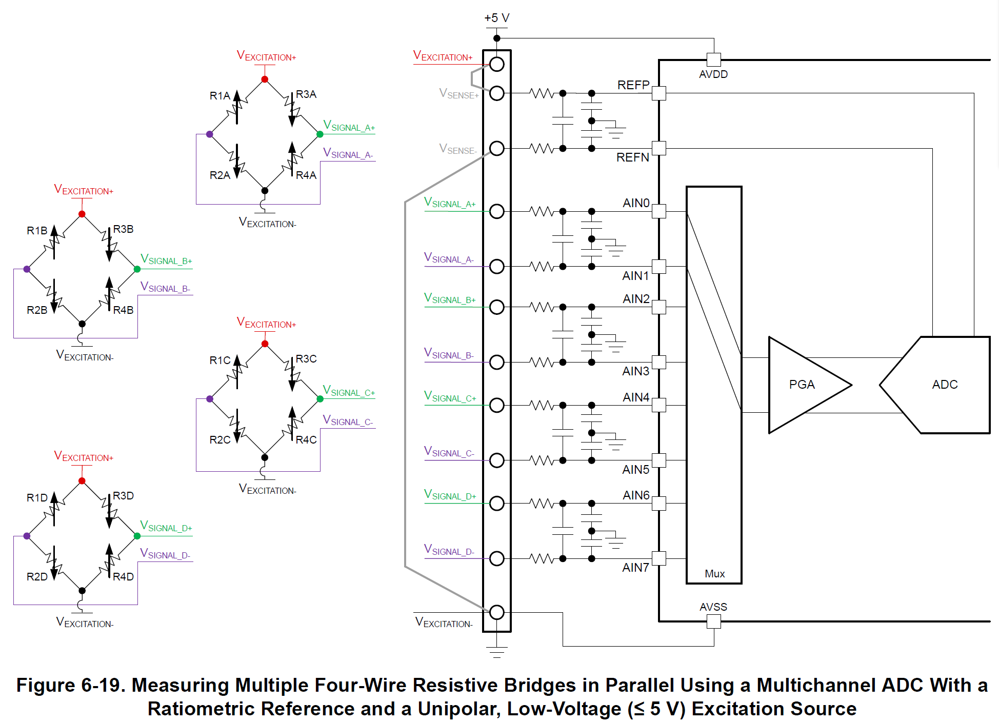
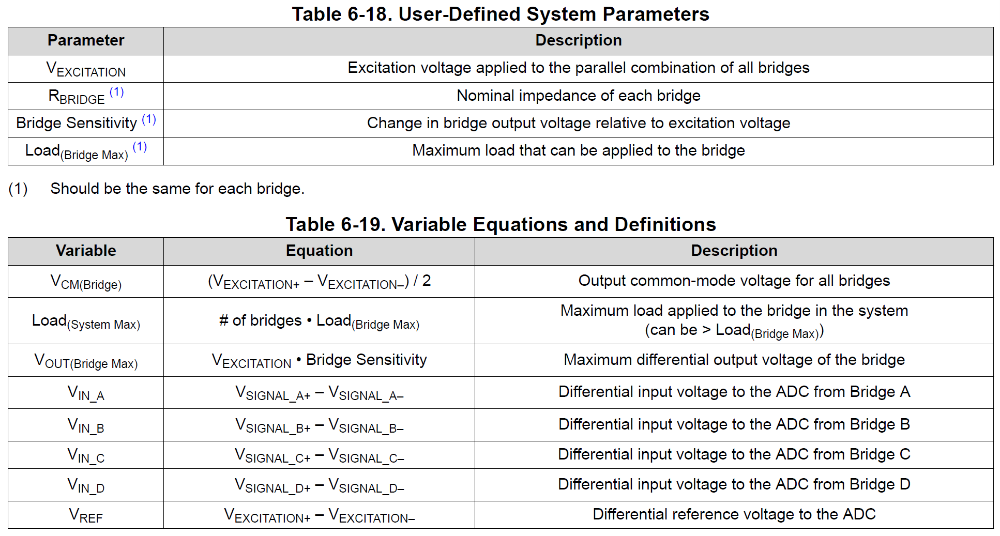

>[Torna all'indice](readme.md#fasi-progetto)

## Formula ADS1256 Output Code

Il codice di uscita dell'ADS1256 è dato da:

$$Code = 2^{23} \cdot \frac{(V_+ - V_-)}{2V_{REF}}$$

con una escursione massima di $\pm V_{\text{REF}}$, cioè, con un range complessivo ampio $2V_{\text{REF}}$

Dove:
- $V_+$ è la tensione sull'ingresso positivo
- $V_-$ è la tensione sull'ingresso negativo
- $V_{REF}$ è la tensione di riferimento
- $2^{23}$ rappresenta metà della risoluzione totale (24 bit)

| V+ Input | Formula | Calcolo | Codice Decimale | Codice Hex |
|----------|---------|---------|-----------------|------------|
| +2Vref | $2^{23} \cdot \frac{2V_{\text{REF}}}{2V_{\text{REF}}}$ | $2^{23} \cdot 1 = 2^{23}$ | 8.388.608 | 0x800000 |
| 0 | $2^{23} \cdot \frac{0}{2V_{\text{REF}}}$ | $2^{23} \cdot 0 = 0$ | 0 | 0x000000 |
| -2Vref | $2^{23} \cdot \frac{-2V_{\text{REF}}}{2V_{\text{REF}}}$ | $2^{23} \cdot (-1) = -2^{23}$ | -8.388.608 | 0x800000 |

## Polarizzazione cella e ADC comune

## Polarizzazione cella e ADC separate

## Quattro celle in parallelo

## Quattro celle multiplexate

Riassunto configurazione:

Effetti delle due configurazioni precedenti sulla distribuzione del carico:

>[Torna all'indice](readme.md#fasi-progetto)
