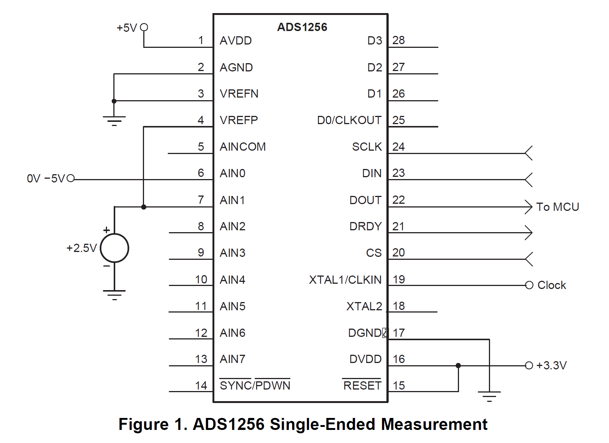
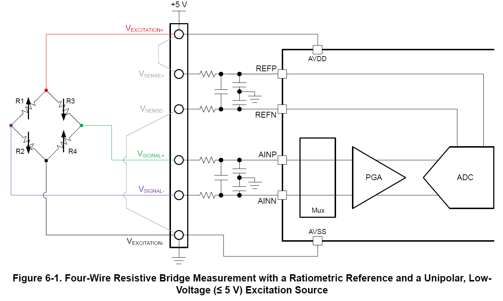

## Specifiche Cella di Carico YZC-516C

## Capacità e Range
- Range disponibili: 0.1, 0.2, 0.3, 0.5, 1, 2 tonnellate

## Specifiche Elettriche
- Tensione di uscita: 2.0±0.05 mV/V
- Resistenza di ingresso: 365±5 Ω
- Resistenza di uscita: 350±3 Ω
- Resistenza di isolamento: >5000 MΩ/50V
- Tensione di eccitazione raccomandata: 5~12V

## Prestazioni e Precisione
- Classe di precisione: C2
- Errore combinato: ≤ ±0.030
- Creep: 0.02
- Effetto temperatura su sensibilità: 0.0017 %RO/°C
- Effetto temperatura su zero: 0.005 %RO/°C
- Bilanciamento zero: ±1.0 %RO

## Range di Temperatura
- Range temperatura compensata: -10~+40°C
- Range temperatura operativa: -30~+80°C

## Sovraccarichi
- Sovraccarico di sicurezza: 150% RO
- Sovraccarico ultimo: 200% RO

## Specifiche Meccaniche
- Materiale: Lega di acciaio
- Cavo: Schermato Ø5.0X3.5m

## Dimensioni
| Capacità    | B (mm) | D          |
|-------------|--------|------------|
| 100-300kg   | 19.05  | M12x1.75   |
| 500kg       | 25.4   | M12x1.75   |
| 1t-2t       | 25.4   | M16x2      |

## Caratteristiche Speciali
- Alta resistenza all'acqua
- Cavo schermato standard
- Connessione aerea su richiesta

# ADC per Celle di Carico in Ordine di Velocità

| ADC      | Max Sample Rate | Bits | PGA Max | Canali Diff. | Alimentazione | Note |
|----------|----------------|------|---------|--------------|---------------|------|
| ADS1256  | 30k SPS        | 24   | 64x     | 4            | AVDD: 5V, DVDD: 1.8-3.6V | Più veloce ma PGA insufficiente |
| ADS1261  | 40k SPS        | 32   | 32x     | 1            | AVDD: 2.7-3.6V, DVDD: 1.65-3.6V | Veloce, singolo canale |
| ADS1262  | 38k SPS        | 32   | 32x     | 4            | AVDD: 2.7-3.6V, DVDD: 1.65-3.6V | Alta risoluzione, basso rumore |
| ADS1263  | 38k SPS        | 32+24 | 128x   | 6            | AVDD: 2.7-3.6V, DVDD: 1.65-3.6V | Come 1262 ma con più canali e gain esteso |
| MCP3561  | 15k SPS        | 24   | 64x     | 2            | 2.7-3.6V     | Buon compromesso velocità/prestazioni |
| ADS1234  | 2k SPS         | 24   | 128x    | 4            | AVDD: 5V, DVDD: 2.7-5.25V | Ottimizzato per celle di carico |
| ADS1232  | 1.6k SPS       | 24   | 128x    | 2            | AVDD: 5V, DVDD: 2.7-5.25V | Versione 2 canali dell'ADS1234 |
| NAU7802  | 320 SPS        | 24   | 128x    | 1            | 2.7-3.6V     | I2C limita la velocità |
| HX711    | 80 SPS         | 24   | 128x    | 1            | AVDD: 4.8-5.5V | Lento ma ampiamente utilizzato |

## Note aggiuntive
* ADS1256: 8 canali single-ended configurabili come 4 differenziali 
* ADS1261: Singolo canale ad alte prestazioni, velocità massima, 32-bit
* ADS1262: PGA fino a 32x e alta velocità, ottimo per celle di carico, 32-bit
* ADS1263: ADC1 32-bit principale + ADC2 24-bit ausiliario, PGA fino a 128x
* MCP3561: 4 canali single-ended / 2 differenziali con multiplexer
* ADS1234: 4 canali differenziali, 24-bit, ottimizzato per celle di carico
* ADS1232: Come ADS1234 ma con 2 canali differenziali
* NAU7802: singolo canale differenziale dedicato
* HX711: singolo canale differenziale più un canale ausiliario
  
## Note sulla Separazione A/D
- I chip più moderni tendono ad avere generazione interna delle tensioni
- La separazione fisica delle alimentazioni (quando richiesta) aiuta a:
  - Ridurre il rumore
  - Migliorare le prestazioni
  - Aumentare la flessibilità di interfacciamento

## ADS1256 - Specifiche Tecniche

### Caratteristiche Principali
- Risoluzione: 24 bit
- Velocità di campionamento massima: 30 ksps
- Canali di ingresso: 8
- Interfaccia: SPI
- Architettura: Delta-Sigma
- Rating: Catalog

### Configurazione Ingressi
- Tipo: Differenziale o Single-ended
- Configurazione multicanale: Multiplexata
- Range tensione di ingresso: 0V - 5.25V
- Modalità di riferimento: Esterna

### Alimentazione
- Consumo tipico: 36 mW
- Alimentazione analogica: 4.75V - 5.25V
- Alimentazione digitale: 1.8V - 3.6V

### Caratteristiche Operative
- Range temperatura operativa: -40°C a +85°C
- Caratteristiche speciali:
  - Reiezione 50/60 Hz
  - GPIO
  - PGA (Amplificatore a Guadagno Programmabile)

# CALCOLO DEL GUADAGNO DELL’ADC

## Formula ADS1256 Output Code

Il codice di uscita dell'ADS1256 è dato da:

$$Code = 2^{23} \cdot \frac{(V_+ - V_-)}{2V_{REF}}$$

con una escursione massima di $\pm V_{\text{REF}}$, cioè, con un range complessivo ampio $2V_{\text{REF}}$

Dove:
- $V_+$ è la tensione sull'ingresso positivo
- $V_-$ è la tensione sull'ingresso negativo
- $V_{REF}$ è la tensione di riferimento
- $2^{23}$ rappresenta metà della risoluzione totale (24 bit)

| V+ Input | Formula | Calcolo | Codice Decimale | Codice Hex |
|----------|---------|---------|-----------------|------------|
| +2Vref | $2^{23} \cdot \frac{2V_{\text{REF}}}{2V_{\text{REF}}}$ | $2^{23} \cdot 1 = 2^{23}$ | 8.388.608 | 0x800000 |
| 0 | $2^{23} \cdot \frac{0}{2V_{\text{REF}}}$ | $2^{23} \cdot 0 = 0$ | 0 | 0x000000 |
| -2Vref | $2^{23} \cdot \frac{-2V_{\text{REF}}}{2V_{\text{REF}}}$ | $2^{23} \cdot (-1) = -2^{23}$ | -8.388.608 | 0x800000 |

## Formula ADS1256 consigliata per ingressi single ended (non duali)

Il codice di uscita dell'ADS1256 è dato da:

$$Code = 2^{23}\cdot \frac{(V_+ - V_-)}{2V_{REF}} = \frac{2^{23}}{2} \cdot \left(\frac{V_+}{V_{REF}} - 1\right)$$

con una escursione massima di $2V_{\text{REF}}$

Dove:
- $V_+$ è la tensione sull'ingresso positivo
- $V_-$ è la tensione sull'ingresso negativo
- $V_{REF}$ è la tensione di riferimento
- $2^{23}$ rappresenta metà della risoluzione totale (24 bit)

| V+ Input | Formula | Calcolo | Codice Decimale | Codice Hex |
|----------|---------|---------|-----------------|------------|
| 2Vref | $\frac{2^{23}}{2} \cdot \left(\frac{2V_{REF}}{V_{REF}} - 1\right)$ | $\frac{2^{23}}{2} \cdot (2-1) = \frac{2^{23}}{2}$ | 4.194.304 | 0x400000 |
| Vref | $\frac{2^{23}}{2} \cdot \left(\frac{V_{REF}}{V_{REF}} - 1\right)$ | $\frac{2^{23}}{2} \cdot (1-1) = 0$ | 0 | 0x000000 |
| 0 | $\frac{2^{23}}{2} \cdot \left(\frac{0}{V_{REF}} - 1\right)$ | $\frac{2^{23}}{2} \cdot (0-1) = -\frac{2^{23}}{2}$ | -4.194.304 | 0xC00000 |

Per ovviare al risultato indesiderato di avere un valore negativo a fronte di un ingresso positivo possiamo sommare 2^23 al risultato finale:

Formula con 2^22 sommato alla fine:

$$Code = \frac{2^{23}}{2} \cdot \left(\frac{V_+}{V_{REF}} - 1\right) + 2^{22}$$

| V+ Input | Formula | Calcolo | Codice Decimale | Codice Hex |
|----------|---------|---------|-----------------|------------|
| 2Vref | $\frac{2^{23}}{2} \cdot \left(\frac{2V_{REF}}{V_{REF}} - 1\right) + 2^{22}$ | $4.194.304 + 4.194.304$ | 8.388.608 | 0x800000 |
| Vref | $\frac{2^{23}}{2} \cdot \left(\frac{V_{REF}}{V_{REF}} - 1\right) + 2^{22}$ | $0 + 4.194.304$ | 4.194.304 | 0x400000 |
| 0 | $\frac{2^{23}}{2} \cdot \left(\frac{0}{V_{REF}} - 1\right) + 2^{22}$ | $-4.194.304 + 4.194.304$ | 0 | 0x000000 |

Se poi si aggiunge pure un guadagno di due si potrebbero sfruttare tutte le divisioni consentite dall'ADC:

Formula modificata con guadagno G=2:

$$Code = G \cdot 2^{23} \cdot \left(\frac{V_+}{V_{REF}} - 1\right) + 2^{23}$$

| V+ Input | Formula | Calcolo | Codice Decimale (G=2) | Codice Hex |
|----------|---------|---------|-----------------|------------|
| 2Vref | $G \cdot 2^{23} \cdot \left(\frac{2V_{REF}}{V_{REF}} - 1\right) + 2^{23}$ |  8.388.608 + 8.388.608$ | 16.777.216 | 0x1000000 |
| Vref | $G \cdot 2^{23} \cdot \left(\frac{V_{REF}}{V_{REF}} - 1\right) + 2^{23}$ |  0 + 8.388.608$ | 8.388.608 | 0x800000 |
| 0 | $G \cdot 2^{23} \cdot \left(\frac{0}{V_{REF}} - 1\right) + 2^{23}$ |  -8.388.608 + 8.388.608$ | 0 | 0x000000 |

## Polarizzazione cella e ADC comune

## Polarizzazione cella e ADC separate

## Dimensionamento di una singola cella

## Analisi Range ADC e Guadagno per Celle di Carico

### Specifiche di Base
* ADS1256: range ingresso = ±VREF (tipicamente ±2.5V, range totale 5V)
* Celle di carico: 
 * Sensibilità = 2.0±0.05 mV/V
 * Tensione eccitazione raccomandata = 5-12V

### Calcolo Output Celle e Guadagno
* Output cella a fondo scala = 5V × 2mV/V = 10mV
* Guadagno teorico = 2.5V/10mV = 250
* Guadagni disponibili ADS1256: 1, 2, 4, 8, 16, 32, 64
* Scelta: G=64 (massimo disponibile)

### Analisi Range Effettivo
* Segnale amplificato massimo = 10mV × 64 = 640mV
* Range totale ADC = 5V (da -2.5V a +2.5V)
* Utilizzo range ADC = 640mV/5000mV = 12.8%

## Risoluzione Effettiva
* Range totale ADC = 2^24 = 16.777.216 livelli
* Livelli effettivi utilizzati = 16.777.216 × 0.128 = 2.147.483 livelli
* La rimanente amplificazione necessaria (circa 4×) dovrà essere gestita via software

## Conclusione
Anche utilizzando solo il 12.8% del range disponibile, abbiamo comunque più di 2 milioni di livelli, 
ben oltre i 50.000-100.000 livelli tipicamente necessari per una buona risoluzione nelle misure di peso.

Considerando che per misure di peso servono tipicamente 50,000-100,000 livelli per una buona risoluzione, anche utilizzando solo il 12.8% del range abbiamo ancora una risoluzione più che adeguata (>4 milioni di livelli).

## Calcolo Risoluzione Sensore 500kg

### Dati
* Capacità = 500kg
* Sensibilità = 2mV/V
* Vcc = 5V
* Guadagno ADS1256 = 64
* ADC = 24 bit = 16.777.216 livelli
* Utilizzo range = 12.8%
* Livelli effettivi = 2.147.483

### Calcolo
* Risoluzione = 500kg/2.147.483 = 0.233 grammi

Nota: questa è la risoluzione teorica dell'ADC. La risoluzione effettiva sarà limitata da:
* Classe di precisione del sensore (C2)
* Rumore elettrico
* Deriva termica
* Altri fattori ambientali

## Calcolo Risoluzione Sensore 2t

### Dati
* Capacità = 2000kg
* Sensibilità = 2mV/V
* Vcc = 5V
* Guadagno ADS1256 = 64
* ADC = 24 bit = 16.777.216 livelli
* Utilizzo range = 12.8%
* Livelli effettivi = 2.147.483

### Calcolo
* Risoluzione = 2000kg/2.147.483 = 0.931 grammi

Nota: questa è la risoluzione teorica dell'ADC. La risoluzione effettiva sarà limitata da:
* Classe di precisione del sensore (C2)
* Rumore elettrico
* Deriva termica
* Altri fattori ambientali
  
## Non linearità cella di carico

Dalla scheda tecnica:
- Combined error < ±0.030%RO
- Questo include sia non linearità che isteresi.

Dividendo ulteriormente:
- Creep (deriva) = 0.02%RO 
- Zero balance = ±1.0%RO

Per una cella da 300kg significa:
- Errore combinato max: ±0.03% * 300kg = ±0.09kg
- Creep: 0.02% * 300kg = 0.06kg
- Errore di zero: ±1% * 300kg = ±3kg

Ci sono anche gli effetti della temperatura:
- Sulla sensibilità: 0.0017%RO/°C
- Sullo zero: 0.005%RO/°C
Quindi è una cella di classe C2 con prestazioni tipiche per applicazioni industriali/commerciali, dove l'isteresi e non linearità sono mantenute entro lo 0.03% del fondo scala.

## Non linearità ADC
L'ADS1256 ha una non linearità (INL - Integral Non-Linearity) tipica di ±0.0003% FSR (Full Scale Range) e massima di ±0.0015% FSR.

Confrontando:
- Cella di carico: ±0.030% RO
- ADS1256: ±0.0015% FSR (worst case)

La non linearità dell'ADC è circa 20 volte migliore della cella di carico, quindi praticamente trascurabile nel budget di errore complessivo del sistema. Il fattore limitante è decisamente la cella di carico.

CALIBRAZIONE
•	la calibrazione ha due scopi principali:
•	Azzeramento (offset q):
•	Rimuove il peso della struttura
•	Compensa derive termiche
•	Idealmente pone lo zero a metà range ADC
•	Taratura scala (m):
•	Converte conteggi ADC in unità fisiche (kg, N)
•	Compensa differenze tra celle
•	Corregge non linearità del sistema
•	La posizione dello zero a metà range è una scelta progettuale che:
•	Massimizza range dinamico bidirezionale
